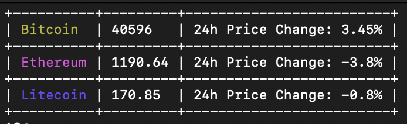

## cryptowatcher

A cryptocurrency price tracker written in Rust.
## usage

```
cryptowatcher 0.1.0
Hossein Dindar <hosseind2017@gmail.com>
A cryptocurrency price tracker written in Rust.

USAGE:
    cryptowatcher <TOKENS>

ARGS:
    <TOKENS>    additional tokens that you can add to track, like ripple,stellar

```

## Installation

Via cargo

```
cargo install cryptowatcher
```

## screenshot



## license

This project is license used the MIT license. See [LICENSE](LICENSE) for more details.
